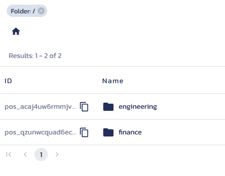

# User-based Access Control with Agent Files in Python

An example Python app demonstrating how to integrate Pangea's [AuthZ][] and
[Secure Share][] services to apply user-based authorization to control access to
files fetched via agents.

## Prerequisites

- Python v3.12 or greater.
- pip v24.2 or [uv][] v0.5.2.
- A [Pangea account][Pangea signup] with AuthZ and Secure Share enabled.
- An [OpenAI API key][OpenAI API keys].

## Setup

### Pangea AuthZ

The setup in AuthZ should look something like this:

#### Resource types

| Name        | Permissions |
| ----------- | ----------- |
| engineering | read        |
| finance     | read        |

#### Roles & access

> [!TIP]
> At this point you need to create 2 new Roles under the `Roles & Access` tab in
> the Pangea console named `engineering` and `finance`.

##### Role: engineering

| Resource type | Permissions (read) |
| ------------- | ------------------ |
| engineering   | ✔️                 |
| finance       | ❌                 |

##### Role: finance

| Resource type | Permissions (read) |
| ------------- | ------------------ |
| engineering   | ❌                 |
| finance       | ✔️                 |

#### Assigned roles & relations

| Subject type | Subject ID | Role/Relation |
| ------------ | ---------- | ------------- |
| user         | alice      | engineering   |
| user         | bob        | finance       |

### Pangea Secure Share

The files from [a previous example][python-rag-authz] should be uploaded to
Secure Share in two folders like so:




### Repository

```shell
git clone https://github.com/pangeacyber/python-file-authz.git
cd python-file-authz
```

If using pip:

```shell
python -m venv .venv
source .venv/bin/activate
pip install .
```

Or, if using uv:

```shell
uv sync
source .venv/bin/activate
```

The sample can then be executed with:

```shell
python -m file_authz --user alice "How much does John Doe make?"
```

## Usage

```
Usage: python -m file_authz [OPTIONS] PROMPT

Options:
  --user TEXT              Unique username to simulate retrieval as.
                           [required]
  --authz-token SECRET     Pangea AuthZ API token. May also be set via the
                           `PANGEA_AUTHZ_TOKEN` environment variable.
                           [required]
  --share-token SECRET     Pangea Secure Share API token. May also be set via
                           the `PANGEA_SHARE_TOKEN` environment variable.
                           [required]
  --pangea-domain TEXT     Pangea API domain. May also be set via the
                           `PANGEA_DOMAIN` environment variable.  [default:
                           aws.us.pangea.cloud; required]
  --model TEXT             OpenAI model.  [default: gpt-4o-mini; required]
  --openai-api-key SECRET  OpenAI API key. May also be set via the
                           `OPENAI_API_KEY` environment variable.  [required]
  --help                   Show this message and exit.
```

Assuming user "alice" has permission to see engineering documents, they can
query the LLM on information regarding those documents:

```
$ python -m rag_authz --user alice "What is the software architecture of the company?"

The software architecture consists of a frontend built with React.js, Redux,
Axios, and Material-UI, while the backend is developed using Node.js and
Express.js. The database employed is MongoDB, and authentication and
authorization are handled via JSON Web Tokens (JWT) and OAuth 2.0. Version
control is managed using Git and GitHub.
```

But they cannot query finance information:

```
$ python -m rag_authz --user alice "What is the top salary in the Engineering department?"

I don't know the answer, and you may not be authorized to know the answer.
```

And vice versa for "bob", who is in finance but not engineering.

[AuthZ]: https://pangea.cloud/docs/authz/
[Secure Share]: https://pangea.cloud/docs/share
[Pangea signup]: https://pangea.cloud/signup
[OpenAI API keys]: https://platform.openai.com/api-keys
[uv]: https://docs.astral.sh/uv/
[python-rag-authz]: https://github.com/pangeacyber/python-rag-authz/tree/main/rag_authz/data
